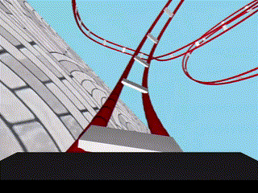
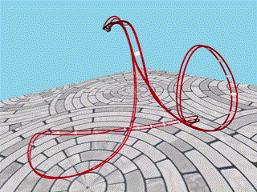

# Roller-Moonster

  
  

This is a roller coaster simulation implemented using pyglet, by Mechanical Engineering undergraduate student in SNU, as a homework project. Camera codes and basic skeletons are referenced from [SNU_ComputerGraphics](https://github.com/SNU-IntelligentMotionLab/SNU_ComputerGraphics_).

## Requirements

This code uses [Pyglet](https://github.com/pyglet/pyglet) which is a cross-platform windowing library under Python 3.8+. 
Supported platforms are:

* Windows 7 or later
* Mac OS X 10.3 or later
* Linux

## Installation

First, download miniconda(recommended) or anaconda.
- **[Download Miniconda](https://www.anaconda.com/docs/getting-started/miniconda/install)**
- [Download Anaconda](https://docs.conda.io/projects/conda/en/latest/user-guide/install/index.html)

Second, clone repository.

    git clone https://github.com/JMacoustic/CrawlingSnake.git

Finally, go into the cloned repo and create environment.
    
    cd path/to/cloned/repo/
    conda env create -f environment.yml

## Run

Now, simply activate conda environment and run the code.

    conda activate roller_env
    python main.py

## How to play

#### 🧑‍💻 Keyboard
- ``P`` — Start / Pause simulation  
- ``R`` — Reset simulation to initial state  
- ``F`` — Switch between "Modified Frenet Frame" and "Head-up Frame" (may take a few seconds to regenerate)  
- ``1`` — Switch to **first-person view** (ride the roller coaster)  
- ``2`` — Switch to **third-person view** (external camera with trackball control)

#### 🖱️ Mouse
- ``left click + drag`` — Intuitively rotate the view using a trackball-style controller (in third-person view)  
- ``scroll wheel`` — Zoom in and out